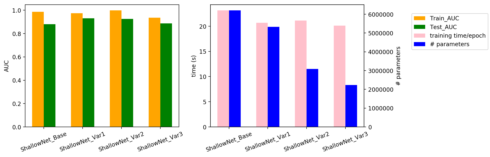

# Diabetic Retinopathy Classification using PCA-involved CNN models

Diabetic retinopathy (DR) is the leading cause of preventable blindness. With the development of medical imaging techniques and pattern recognition techniques, convolutional neural networks are helping doctors to identify the stage of DR patients faster.  

In this project, we explored various CNN models on classifying DR images and applied the PCA method on activation maps of these models to expedite the process (method proposed by [Garg et al.](https://arxiv.org/abs/1812.06224)).  

<!-- TABLE OF CONTENTS -->
## Table of Contents

* [Contributors](#contributors)
* [Data](#data)
* [Contents](#contents)
* [Shallow CNN](#shallow-cnn)
* [Deep CNN](#deep-cnn-models)

## Contributors
Jiyu Wang  
Chunlei Zhou  

## Contents
Folders and files in this repository:
* Data: the dataset of preprocessed images. Within /train and /test, images are stored in folders named with their labels, which enables the use of image data generator in Tensorflow.
* report_images: images created during analyses and used in reports
* Saved_files
    - history: training history of each model
    - models: saved files of trained models
    - PCA: analysis result of PCA on base models
    - training_times.csv: training time of each model
* sources
    - ShallowNet.py: functions to create ShallowNets
    - util.py: functions used in analysis
* 001-preprocessing.ipynb: notebook for image preprocessing
* 002 files: training and analyses on shallow CNN models
* 003 files: training and analyses on conventional CNN models using Tensorflow
    
<!-- Data -->
## Data
The DR image dataset we are using is from a kaggle competition ([APTOS 2019 Blindness Detection](https://www.kaggle.com/c/aptos2019-blindness-detection)). Since the labels of the original test set was not provided, the original training set was divided into the current training set and test set. 

To remove the variance introduced by unrelated factors such as lighting condition when image was taken, the camera condition, etc., the DR images were preprocessed while critical information for DR classifying was maintained. The details of the prepocessing can be found in [001-preprocessing.ipynb](001-preprocessing.ipynb)

## Shallow CNN
Shallow CNN models implemented using Tensorflow would be a good tool to study the method of PCA-involved CNN models, due to our limited size of the training set and faster training time of shallow networks. 

* Shallow CNN base model

The **base shallow model** consists of four convolutional blocks, each of which contain two convolutional layers as well as a maxpooling layer and a batch normalization layer.

Structure of the ShallowNet Base model

* PCA analysis on base model

After the pretraining of the base model, **PCA analysis** was performed on its activation map and determined the critical number of filters/nodes of the conv layers and dense layers. The number of filters/nodes of conv layers and fc layers was determined by the number of critical components of each layer, while conv layers that contain fewer critical components than the layer ahead were also removed.

Below are the details of the shallow models:

Comparisons on structures of ShallowNets

* Performance of variant models

Three **variant models** were created based on the PCA result:

    - var1: only modify conv layers
    - var2: only modify fc layers
    - var3: modify both conv layers and fc layers

Performance of these three models on classification AUC is comparable to the base model, while training time and number of parameters are reduced.

Details of the analysis can be found in [this notebook](002c-shallow%20CNN_analysis.ipynb)

## Deep CNN models
